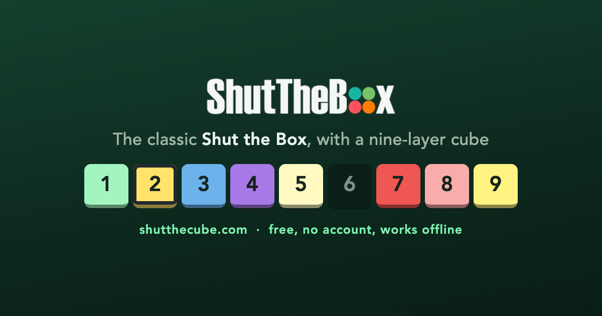

# Shut The Cube

A free browser dice game based on the classic
[Shut The Box](https://en.wikipedia.org/wiki/Shut_the_Box), with a nine-layer "cube" variant where
a matching column of tiles collapses together for a bonus. No ads, no account, works offline.

**▶ Play it at [shutthecube.com](https://shutthecube.com/)**



[How to play](https://shutthecube.com/how-to-play.html) ·
[About](https://shutthecube.com/about.html) ·
[Privacy](https://shutthecube.com/privacy.html)

Made by [Victor Saly](https://victorsaly.com).

## The game

Roll two dice, then select tiles that add up to the roll. Match the roll exactly to bank those
tiles and roll again; when no combination is left, the game ends. Clear the whole board to Shut
the Box.

| Mode | Board | Rule of its own |
| --- | --- | --- |
| **Beginner** | 1 row | Classic Shut The Box. Once nothing above a 6 is left you may roll a single die. |
| **Medium** | 9 rows | Matching columns collapse together for a bonus, plus special tiles and between-turn events. |
| **Ninja** | 9 rows | The same, with 30 seconds a turn. Run out and the game ends. |

On the nine-row boards, playing a tile also claims the same face in the rows directly above and
below it, as far as the run of matching faces continues — those extra tiles score as **Bonus**.
Any tile that would take a column with it carries a badge with the number of tiles it claims, and
hovering or focusing it previews the whole run, so the big moves are visible *before* you commit.
Once the whole board is worth 6 or less, the second die is dropped automatically.

**Pass & play:** flip the switch on the menu and any mode becomes a two-player match on one
device — Player 1 finishes, hands the device over, and Player 2 chases their total on the *same
board*: identical faces, identical special tiles, your own dice. Higher banked total wins; a
shut-box tie goes to whoever needed fewer rolls. Match games stay out of the solo records.

The nine-row modes seed a few **special tiles** — **★ Wild** counts as whatever you still need,
**◆ Locked** only plays alone, matching the entire roll — and roughly one turn in six brings an
**event**: a lucky third die, a reshuffle, or a tile turning wild. Neither changes scoring: a shut
tile is always worth its face.

### Controls

- <kbd>Space</kbd> rolls, from anywhere on the page; the roll button sits in the middle of the
  board, never a reach away.
- Fully keyboard-playable: <kbd>1</kbd>–<kbd>3</kbd> on the menu deals you into a mode;
  <kbd>Tab</kbd> reaches the board, arrow keys move, <kbd>Enter</kbd> plays a tile,
  <kbd>U</kbd> undoes, <kbd>H</kbd> hints (and cycles the ways a roll can be matched).
- On a phone, shake to roll.
- The speaker button in the header mutes the game and remembers the choice.

### Sound

The game is scored by a small WebAudio marimba ([`src/services/sound.js`](src/services/sound.js)):
every tile plays its own note on the A major pentatonic scale, faces 1–9 climbing it, so any legal
move sounds deliberate. Dice rattle, runs arpeggiate, a shut box rolls the whole scale. It starts
in under a millisecond and ships zero sample bytes.

### Sharing

A finished game shares like Wordle: one button hands the device's share sheet a block card
(🟩🟩🟩⬛…) and a challenge link. Each mode's link is its own page under
[`public/challenge/`](public/challenge/) so the chat preview carries that mode's own 1200×630
card — a query parameter cannot switch `og:image` on a static site — and then deals the recipient
straight onto that board. A finished match shares both players' block rows and the verdict.

### Your data

Games played, best score, average and win rate are kept per mode in your browser's local storage.
Nothing leaves the device and there is no account. Details on the
[privacy page](https://shutthecube.com/privacy.html).

## Design

The interface keeps this game's own identity — the deep forest ground, the pastel tile faces, a
drawn logo — organised by a few rules:

- **Colour has two layers that never trade places.** *Identity* is `--accent`, set by the mode you
  are playing (teal, blue, ember); it colours the chrome — glows, the selected card, your best,
  focus rings — and never a rule. *Meaning* — selected, bonus run, danger, a shut tile — stays the
  same in every mode, so it always reads as rules. The tokens at the top of
  [`src/styles/main.css`](src/styles/main.css) are the whole scheme.
- **Two typographic voices.** Fredoka for the things the game *says* — wordmark, verdicts, the big
  action tile; Spline Sans Mono for the numbers that *change*, so a counting readout never
  jitters. Self-hosted latin-subset woff2; nothing loads from a CDN at runtime.
- **The menu is three cards.** Each mode carries its own drawn mark — the classic row, the
  collapsing column, the field against a clock — and wears its accent, so the card you press and
  the board you land on are recognisably the same thing. The marks animate on hover.
- **The logo is drawn, not a PNG.** A die face of five built from the board's own tiles with the
  centre pip already shut ([`BrandMark.vue`](src/components/BrandMark.vue)) — the whole game in one
  mark, crisp from the 20px header to the 128px social card.
- **Three tile states, distinct without relying on colour.** Playable is full colour, raised;
  unplayable is drained of chroma, flat, set back; shut is a dark hole. Numeral contrast 7.42:1.
- **The board is fluid and one tab stop.** Tile size comes from a container query on the space
  actually left over, so the board fills any screen; the grid has a roving tabindex and a live
  region that announces the roll, each selection and the result.
- **Motion is everywhere and optional.** Cards rise in, the action button breathes, a shut box
  drops confetti in the tile pastels — all of it off under `prefers-reduced-motion`, and the
  ambient background never animates on phones.
- **The static pages wear the same skin** ([`public/static/pages.css`](public/static/pages.css)).

## Development

Requires Node 20.19+.

```bash
npm install
npm run dev       # dev server with hot reload
npm test          # unit and component tests
npm run build     # production build into dist/
npm run preview   # serve the production build locally
npm run social    # regenerate the social/share images (needs Chrome installed)
```

```
src/
  services/gameServices.js   board creation and the subset-sum that decides legal moves
  services/sound.js          the WebAudio marimba: tile notes, dice rattle, fanfares
  services/share.js          Wordle-style score cards and the challenge links
  stores/modes.js            the three difficulty modes and what makes each different
  stores/game.js             the board, turn state machine, timer, undo and hints
  stores/stats.js            per-mode records, persisted to local storage
  components/                the board, tile rows, dice, menu cards, the drawn logo, stats
  composables/               number tweening, shake-to-roll, install prompt
scripts/gen-social.mjs       renders the per-mode social cards with headless Chrome
test/                        unit, store-integration and component tests
public/challenge/            per-mode landing pages that give shared links their own preview
public/static/               icons, splash screens, fonts, social cards, the static pages' skin
```

The app installs as a PWA and precaches everything it needs (~550 KiB); the social cards are
excluded because only link scrapers fetch them.

## Analytics

Off by default: with no token configured the site contacts no third party and sets no cookie,
which a test asserts.

To turn on Cloudflare Web Analytics — cookieless and aggregate, so no consent banner is needed:

1. In the Cloudflare dashboard, **Web Analytics → Add a site** for `shutthecube.com`. You do not
   need to move your DNS to Cloudflare.
2. Copy the beacon token. It is public by design — it ships in the page source of every site that
   uses it — so it belongs in a repository *variable*, not a secret.
3. Add it as repository variable `CF_BEACON_TOKEN`
   (*Settings → Secrets and variables → Actions → Variables*).
4. Update [`public/privacy.html`](public/privacy.html) in the same change: the policy currently
   states the game uses no analytics, and that must not become untrue before the code does.

## Deployment

Pushing to `master` builds and publishes to GitHub Pages via
[`.github/workflows/deploy.yml`](.github/workflows/deploy.yml). The workflow runs the tests first
and will not deploy if they fail.

**One-time setup:** in the repository's *Settings → Pages*, set **Source** to **GitHub Actions**.

### Custom domain

The deployed artifact contains `CNAME` with `shutthecube.com`. In the registrar's DNS settings,
point the apex domain to GitHub Pages with these four `A` records:

```
185.199.108.153
185.199.109.153
185.199.110.153
185.199.111.153
```

Add a `CNAME` record for `www` pointing to `victorsaly.github.io`. Then, in GitHub repository
*Settings → Pages*, set the custom domain to `shutthecube.com`, wait for DNS verification, and
enable **Enforce HTTPS**. Redirect `www` to the apex at the registrar so the canonical URL stays
consistent.

The build uses a relative base path, so the same output works from the project page at
`/shutTheCube/` or from the custom domain at the root without a config change.

## History

The original 2018 build (Vue 2, webpack 3) could no longer be installed — `firebase@4` pulled in a
native module that no longer compiles — and it loaded Tailwind from an unversioned CDN URL, so
when that tag moved the tile colours silently stopped existing and the live game lost its styling.

The 2026 rewrite (Vue 3, Vite, Pinia) pins every dependency, loads nothing from a CDN at runtime,
reproduces the original Tailwind 0.x tile palette as local theme tokens, and replaced seven
utility dependencies with small local equivalents — runtime dependencies went from 25 to 3. The
redesign that followed added the mode cards, the drawn logo, the synthesised sound, sharing, and
the design-token scheme above. The full story, decision by decision, is in the git history.
