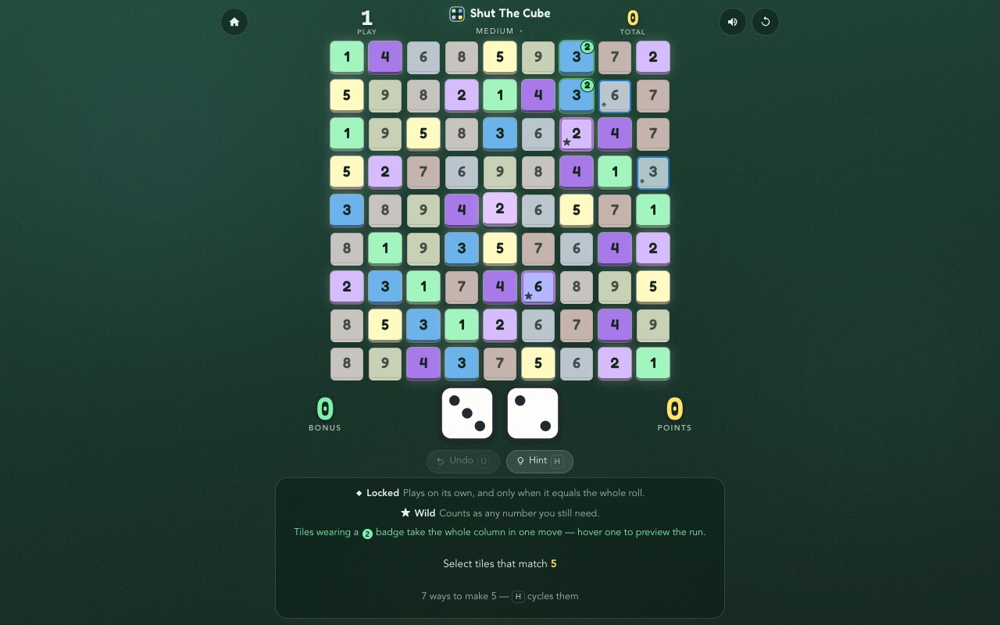
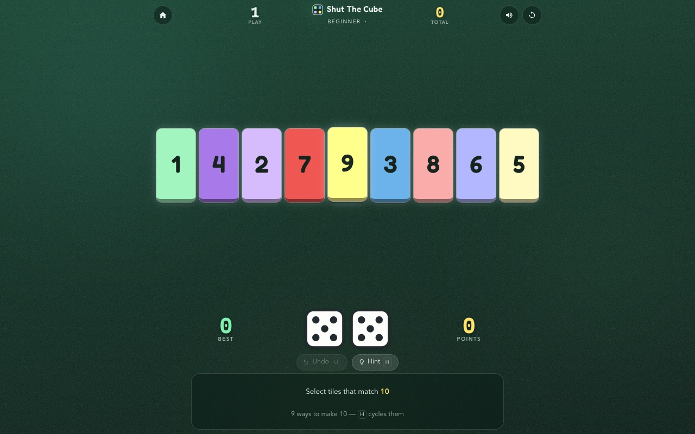
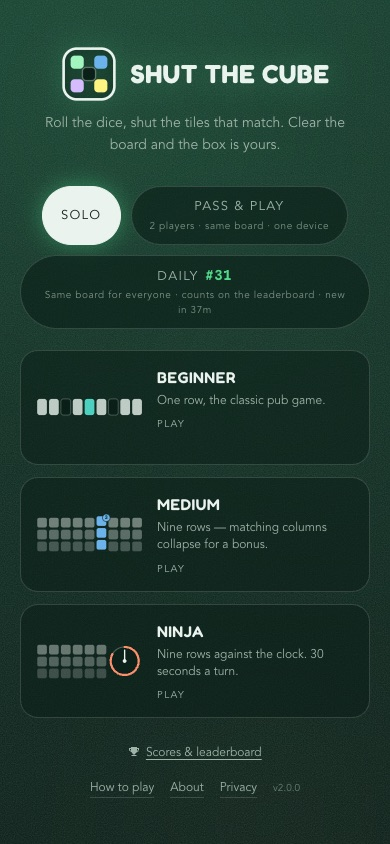
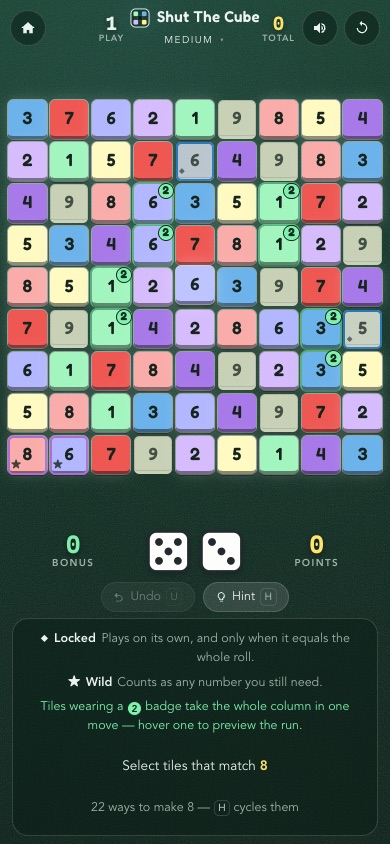

# Shut The Cube

A free browser dice game based on the pub classic
[Shut The Box](https://en.wikipedia.org/wiki/Shut_the_Box), with a nine-row "cube" variant where
matching columns of tiles collapse together for a bonus. No ads, no account needed, and it works
offline once loaded.

**Play it at [shutthecube.com](https://shutthecube.com/)**



[How to play](https://shutthecube.com/how-to-play.html) ·
[About](https://shutthecube.com/about.html) ·
[Privacy](https://shutthecube.com/privacy.html)

## How to play

1. Roll two dice.
2. Pick open tiles that add up to the roll. Match it exactly and those tiles are shut.
3. Roll again. When no combination of open tiles can make the roll, the game ends.
4. Your score is the total of the tiles you shut. Shut every tile and you have shut the box.

## Modes

| Mode | Board | What's different |
| --- | --- | --- |
| **Beginner** | 1 row, tiles 1–9 | Classic Shut The Box. Once nothing above 6 is left you may roll a single die. |
| **Medium** | 9 rows | The cube: playing a tile also takes the same number in the rows directly above and below it, as far as the run continues. Those extra tiles score as **Bonus**. |
| **Ninja** | 9 rows | Medium against the clock: 30 seconds a turn, and the game ends if you run out. |

<p>
  
</p>

On the nine-row boards:

- A tile that would take a column with it shows a badge with how many tiles it claims; hover or
  focus it to preview the run before you commit.
- A few **special tiles** are seeded in: **★ Wild** counts as any number you still need, and
  **◆ Locked** can only be played on its own, when it equals the whole roll.
- About one turn in six brings an **event**: a lucky third die, a reshuffle of the rows, or a tile
  turning wild.
- When the whole board is worth 6 or less, the second die is dropped automatically.

<p>
  
  
</p>

## Features

- **Daily challenge.** Turn on *Daily* and every mode deals the same board and dice to everyone
  that day; it changes at local midnight. Only your first attempt counts.
- **Leaderboard (optional).** Sign in with Google to put your daily score on the board, with
  today's and all-time rankings per mode. A daily finished before signing in can still be posted
  afterwards. Everything else works without signing in.
- **Pass & play.** Two players on one device take turns on the identical board. Higher total wins;
  a tie where both shut the box goes to whoever needed fewer rolls.
- **Challenge links.** A finished game shares a Wordle-style block card and a link that deals the
  recipient the same board, so there is something to beat.
- **Your stats.** Games played, best score, average and win rate per mode, kept in your browser.
- **Keyboard, touch and shake.** <kbd>Space</kbd> rolls, arrow keys and <kbd>Enter</kbd> play
  tiles, <kbd>U</kbd> undoes, <kbd>H</kbd> shows a hint and cycles through the ways to make the
  roll, and <kbd>1</kbd>–<kbd>3</kbd> start a mode from the menu. On a phone, shake to roll.
- **Sound.** A small WebAudio marimba: each tile number plays its own note, so moves sound
  musical. No audio files are downloaded. Mute from the header.
- **Installable and offline.** A PWA that precaches the whole game.

## Tech stack

Vue 3, Pinia, Vite, Tailwind CSS 4 and vite-plugin-pwa, tested with Vitest. Hosted on GitHub Pages.
The optional leaderboard and sign-in use a separate shared API; the game does not depend on it.

## Run locally

Requires Node 20.19 or newer.

```bash
npm install
npm run dev       # dev server with hot reload
npm test          # unit, store and component tests
npm run build     # production build into dist/
npm run preview   # serve the production build
npm run social    # regenerate the social share images (needs Google Chrome)
npm run icons     # regenerate the favicons and app icons
```

Optional build-time variables:

- `VITE_ARCADE_API` points the leaderboard at a different API (defaults to the production one).
- `VITE_CF_BEACON` turns on Cloudflare Web Analytics. With no token set, the site contacts no
  analytics service and sets no cookie. If you enable it, update
  [`public/privacy.html`](public/privacy.html) in the same change.

## Project structure

```
src/
  services/gameServices.js   board creation and the subset-sum search for legal moves
  services/random.js         seeded randomness behind the daily and challenge links
  services/arcade.js         leaderboard and sign-in client (every call optional)
  services/sound.js          WebAudio marimba and dice sounds
  services/share.js          share cards and challenge links
  stores/                    modes, game state, pass-and-play match, stats, leaderboard
  components/                board, tiles, dice, menu cards, scores panel, logo
scripts/                     social image and icon generators (headless Chrome)
test/                        unit, store and component tests
public/challenge/            per-mode landing pages so shared links get their own preview card
public/*.html                how to play, about and privacy pages
```

## Deployment

Pushing to `master` runs the tests, builds, and publishes to GitHub Pages via
[`.github/workflows/deploy.yml`](.github/workflows/deploy.yml). The custom domain comes from
[`public/CNAME`](public/CNAME). The build uses a relative base path, so it also works from
`/shutTheCube/` on github.io.

## Background

The original 2018 version (Vue 2, webpack, Firebase) stopped installing and lost its styling when
a CDN-hosted stylesheet changed. In 2026 it was rewritten on Vue 3 and Vite with pinned
dependencies and nothing loaded from a CDN at runtime, then extended with the cube modes, sound,
sharing, the daily challenge and the leaderboard.

## License

[MIT](LICENSE)

Made by [Victor Saly](https://victorsaly.com).
